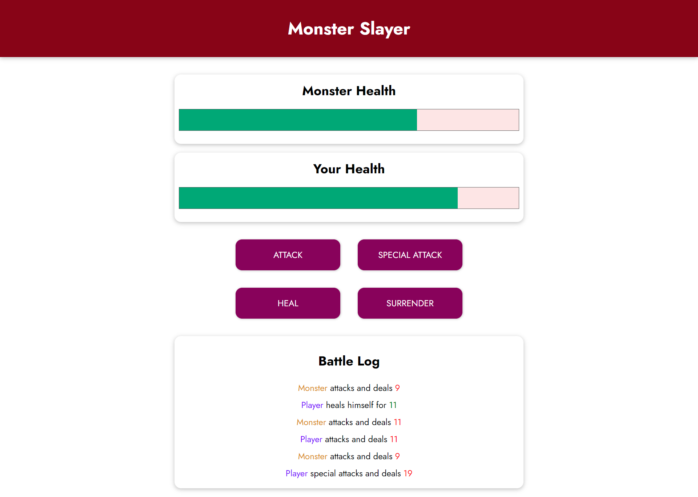

# Monster Slayer Game

This project is a game developed with VueJS that demonstrates core concepts such as data binding, interpolation, event binding, conditional rendering, methods, computed properties, watchers, and more.

## Screenshot

